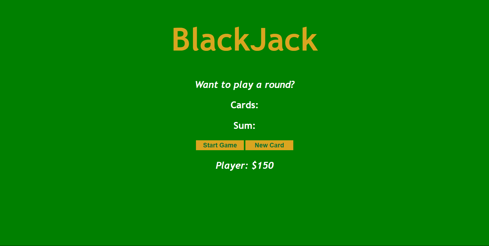

# Black Jack Game

__This is a simple implementation of the classic card game BlackJack using HTML, CSS, and JavaScript. The game allows a player to start a game, draw new cards, and aims to get a sum of cards as close to 21 as possible without exceeding it.__

## Features
- __Start Game__: Initializes a new game with two random cards.
- __Draw New Card__: Allows the player to draw a new card if their sum is less than 21.
- __Game Status__: Displays messages to the player about the current game status, such as whether they can draw a new card, have won (BlackJack), or have lost.

## Code Overview
- HTML: Contains the structure of the game, including buttons for starting the game and drawing new cards, and elements to display the game status, cards, and sum.
- CSS: Basic styling to make the game look visually appealing.
- JavaScript:
    - Global Variables: To keep track of cards, sum, player status, etc.
    - Functions:
        - startGame(): Starts a new game by initializing cards and sum.
        - renderGame(): Updates the game interface based on the current state of the game.
        - getRandomCard(): Generates a random card value between 1 and 13, with special handling for Aces and face cards.
        - newCard(): Adds a new card to the player's hand and updates the game status if the player is still in the game.

## Interface

## How to Play
1. Start the Game: Click on the "Start Game" button to initialize the game with two random cards.
2. Draw New Card: Click on the "New Card" button to draw additional cards in an attempt to get the sum of cards to 21.
3. Game Messages: Follow the messages displayed to know whether you can draw a new card, have won, or have lost.

## Contributing
Feel free to fork this repository and contribute by submitting a pull request. For major changes, please open an issue first to discuss what you would like to change.

## License
This project is licensed under the MIT License. See the license file here: [LICENSE](LICENSE)
